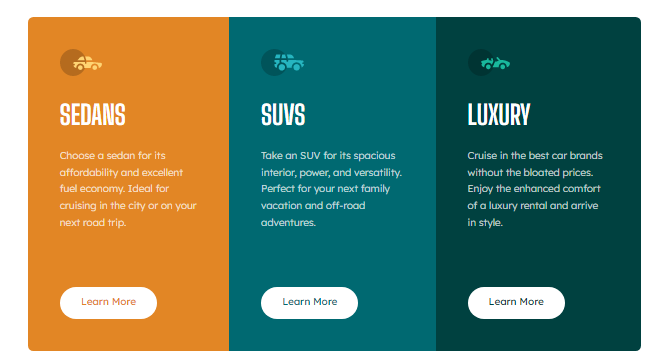

# Frontend Mentor - 3-column preview card component solution

This is a solution to the [3-column preview card component challenge on Frontend Mentor](https://www.frontendmentor.io/challenges/3column-preview-card-component-pH92eAR2-). Frontend Mentor challenges help you improve your coding skills by building realistic projects. 

## Table of contents

- [Overview](#overview)
  - [The challenge](#the-challenge)
  - [Screenshot](#screenshot)
  - [Links](#links)
- [My process](#my-process)
  - [Built with](#built-with)
  - [What I learned](#what-i-learned)
- [Author](#author)

## Overview

### The challenge

Users should be able to:

- View the optimal layout depending on their device's screen size
- See hover states for interactive elements

### Screenshot

### Links

- Solution URL: (https://github.com/jenmurph4610/three-column-preview)
- Live Site URL: (https://jenmurph4610.github.io/three-column-preview/)

## My process

### Built with

- Semantic HTML5 markup
- CSS custom properties
- Flexbox
- Mobile-first workflow

### What I learned

This was just to be a simple project meant to get me back into the swing of things after a break because of illness.  I thought it would take me longer to get my brain back into it, but this ended up coming together fairly quickly and eaily.  The practice from each previous challenge shows with every new challenge I do, the layout and designs are feeling easier and requiring less googling to complete. Feeling more confident each project when it comes to HTML and CSS.  

The only part that gave me issue was with the hover state on the Learn More buttons. Changing the background color was simple, but changing the text color of the anchor tags on hover stumped me for a few minutes.  

I expected to just add "color: white" into each '#section-one .btn:hover' selector where I have the different hover state backgrounds, but the white text did not trickle down to the anchor tag as I expected.  I also tried adding the color to a 'btn:hover a' selector because the font color (unlike the background color) was the same for all three so I tried adding it once for all.  This did not work either.  In the end I had to do that .'btn:hover a' for each section ID, replicating it three times in the CSS.  I don't quite understand why it was necessary to do it this way yet so if anyone knows, I'd love to hear some tips.

## Author

- Frontend Mentor - [@jenmurph4610](https://www.frontendmentor.io/profile/jenmurph4610)
